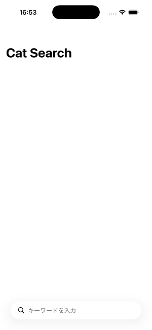
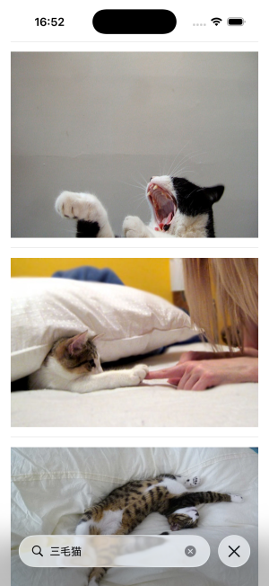

# SwiftUI Search Sample

SwiftUIで作った **検索バー付き画像検索アプリ** です。  
Cat APIを利用して、キーワード入力で画像を取得・表示します。

---

## Features

- 🔍 **検索バー**：`.searchable` を使ったキーワード検索  
- 🖼 **AsyncImage**：非同期で取得した画像を表示  
- ⏳ **ProgressView**：データ取得中はローディング表示  
- 📱 **List表示**：取得した画像を縦スクロールで一覧表示  
- 🧩 **MVVM構成**：Model / ViewModel / View に分けて整理

---

## Usage

1. Xcodeでプロジェクトを開く  
2. iOSシミュレータまたは実機でビルド  
3. 検索バーにキーワードを入力して Enter  
4. 猫画像が一覧で表示されます

---

## File Structure
```
SwiftUI-Search-Sample/
├── Models/
│ └── Cat.swift
├── ViewModels/
│ └── CatViewModel.swift
├── Views/
│ └── ContentView.swift
└── SwiftUI-Search-Sample.xcodeproj
```

---

## 技術スタック

- SwiftUI  
- async/await + URLSession  
- Swift 5.x  
- Xcode 15.x 以上  

---

## Demo

<p align="center">
  
  
</p>


---

## Author

- **taka-sakamoto**  
- GitHub: [https://github.com/taka-sakamoto](https://github.com/taka-sakamoto)
  
