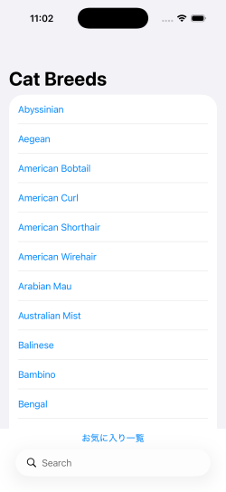
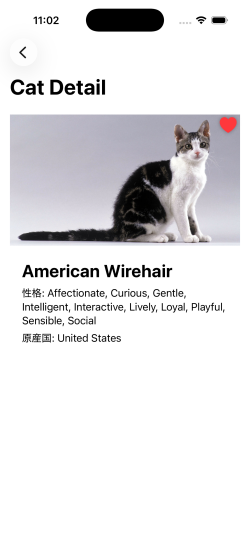
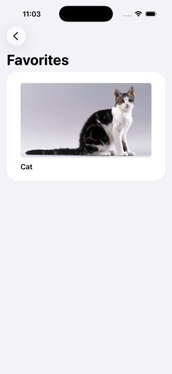

# 🐱 Cat Search App（SwiftUI × CoreData）

## 📱 Overview

This is a simple iOS app that allows users to search for cat images and save their favorites.  
The app is built with a focus on clean UI and intuitive user experience.

---

## 🚀 Features

- Search cat images using API
- Display loading state with ProgressView
- Show detailed information of each cat
- Add and remove favorites (CoreData)
- Favorites list view
- Swipe to delete favorites
- Empty state UI when no favorites are added

---

## 🛠️ Tech Stack

- SwiftUI
- CoreData
- MVVM Architecture
- AsyncImage

---

## 📸 Screenshots
## 検索画面  
   

## 詳細画面（お気に入りボタン付き）  
   
 
## お気に入り一覧  
   

## 空状態UI  
  

---

## 📌 Architecture

This app follows the MVVM architecture pattern:

- View: UI representation
- ViewModel: Business logic and state management
- Model: API response and CoreData entities

---

## 💡 Key Points

### 🔹 CoreData Integration
- Used `@FetchRequest` to automatically update the favorites list
- Managed `NSManagedObjectContext` via Environment

### 🔹 UI/UX Design
- Favorite button placed on top of the image for intuitive interaction
- Clear loading indication using ProgressView
- Empty state UI to guide user actions

### 🔹 Clean Architecture
- Separated search logic and favorite logic into different ViewModels
- Improved maintainability and readability

---

## 🔧 Future Improvements
- Improve breed information display
- Add sorting functionality for favorites
- UI enhancements (e.g. Dark Mode support)
  
---

## 🧑‍💻 Author
GitHub: https://github.com/taka-sakamoto

  
